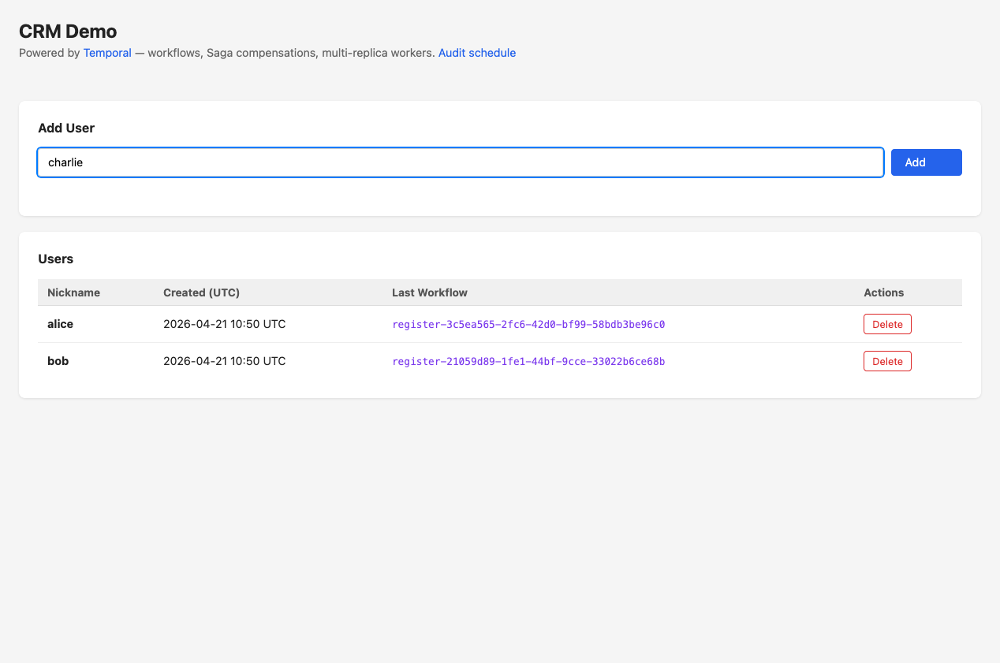
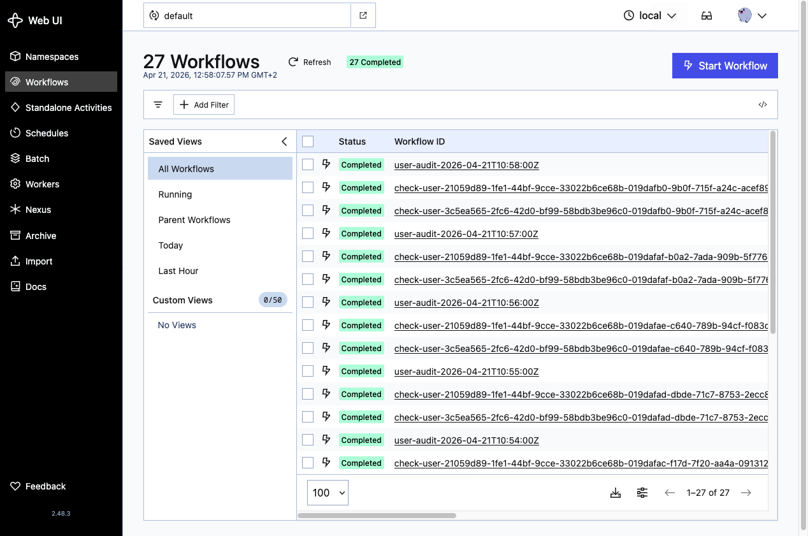
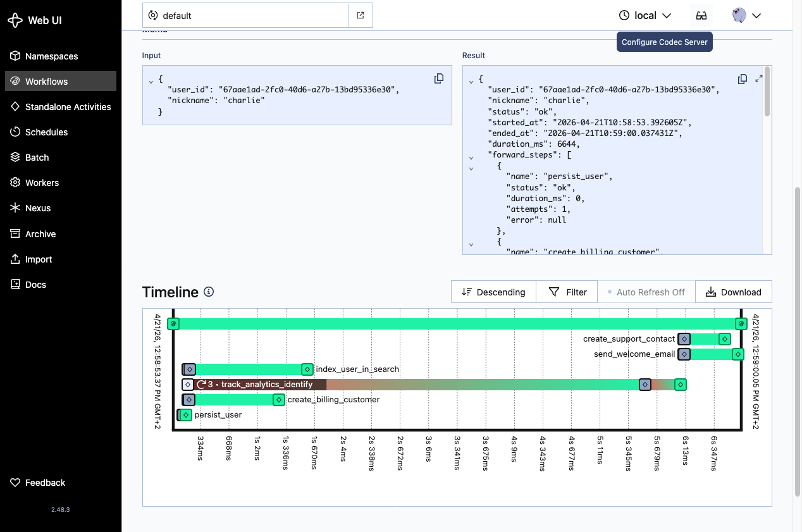
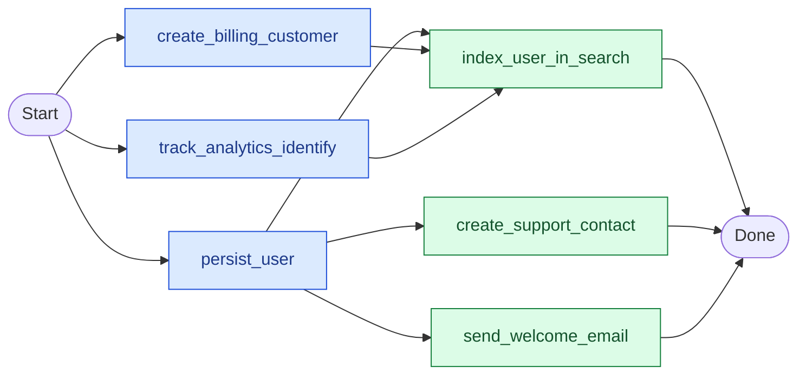
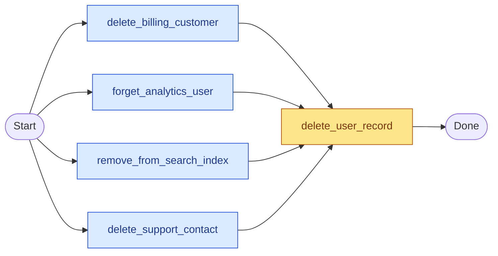

# Temporal CRM Demo

A small, self-contained CRM web app that demonstrates the core capabilities of
[Temporal](https://temporal.io) — durable workflows, activity retries, Saga-style
compensations, scheduled workflows, and multi-replica workers.

Every user action starts a Temporal workflow that fans out to five mocked
external systems with a real dependency graph. Failures are injected
deterministically so you can watch retries stack up and compensations fire in
reverse order, live in the Temporal UI.



---

## Run it

```bash
docker compose up
```

Once all containers are healthy, open:

| URL                                             | What                                                             |
|-------------------------------------------------|------------------------------------------------------------------|
| [http://localhost:8000](http://localhost:8000)  | **CRM UI** — add and delete users, each action starts a workflow |
| [http://localhost:8080](http://localhost:8080)  | **Temporal UI** — inspect workflow timelines, schedules, workers |

For slower, more readable workflow execution (3–6 s per step) run it in demo mode:

```bash
DEMO_MODE=true docker compose up
```

---

## What this demo shows

1. **Workflow dependency graph.** A registration workflow runs 3 parallel L1
   activities, then 2 L2 activities that depend on the first batch. The
   structure is visible in the timeline view of the Temporal UI.
2. **Retries and Saga compensations.** Gateways fail probabilistically. Activity
   retries are configured per call; when retries exhaust, the saga rolls back
   successfully completed steps in reverse order.
3. **Scheduled workflows.** A `user-audit` schedule runs every minute, spawning
   a parent workflow that starts one child workflow per user.
4. **One worker binary, many workflow types.** Onboarding and audit workflows
   are registered in a single worker. Four workflows live side by side in one
   module.
5. **Multi-replica workers.** Three worker containers share the `crm-tasks`
   task queue and appear as distinct pollers in the **Workers** tab.
6. **Shared Pydantic contracts.** The same command class is imported by the
   FastAPI route and the workflow — one definition, no drift.
7. **Rich observability.** Memo updates per phase, custom search attributes
   (`CrmUserId`, `CrmNickname`, `CrmPhase`, `CrmFailureRateSeed`,
   `CrmCompensated`), and full Pydantic result payloads on every
   `ActivityTaskCompleted` event.

## Screenshots

**Workflow list — every user action produces a durable workflow:**



**Timeline view — 3 parallel L1 activities + 2 dependent L2 activities with rich I/O payloads:**



## Workflow dependency graphs

### Registration



Three L1 activities run in parallel. Two L2 activities start only after their
L1 dependencies complete. If any activity ultimately fails after retries, the
saga compensates every previously successful step in reverse order.

### Deletion



Four external deletes fan out in parallel; failures are collected but do not
block the DB delete. The local `delete_user_record` always runs last, so the
user row is removed even if an external system is temporarily unavailable.
The result payload reports which external deletes failed so they can be
retried or reconciled out-of-band.
